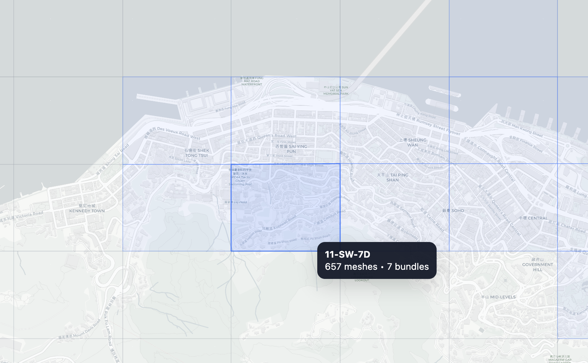
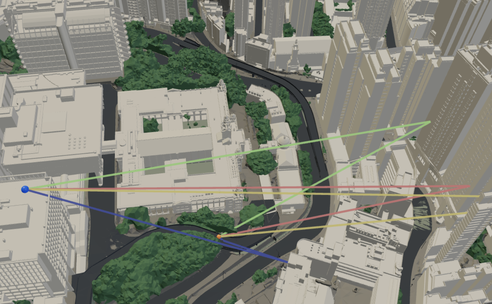
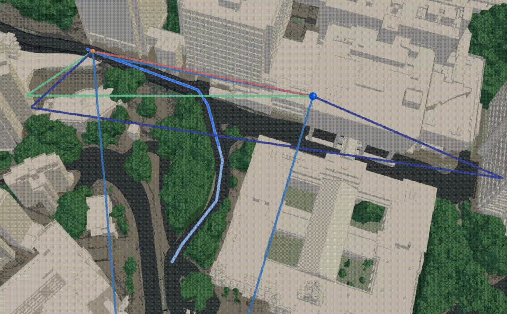
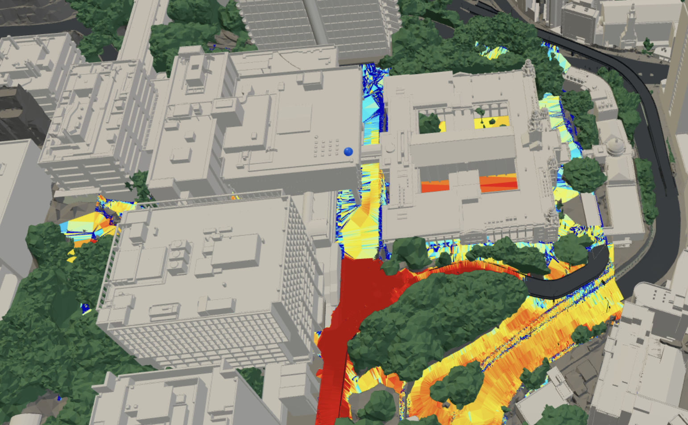
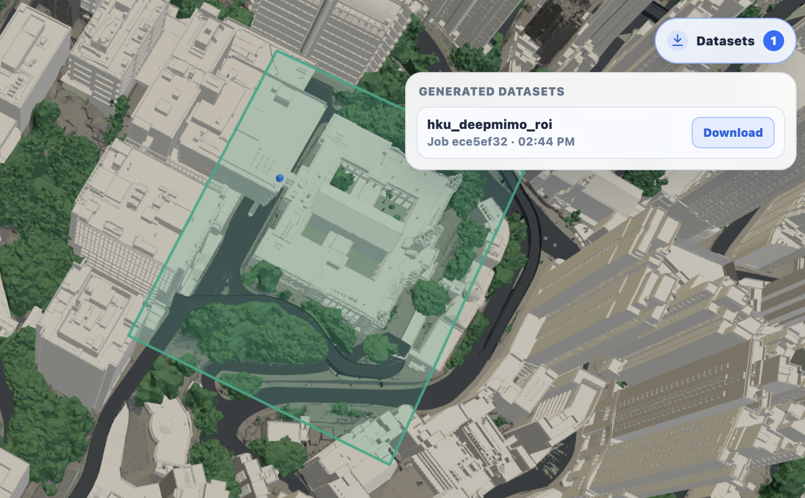

<p align="center">
  <picture>
    <source media="(prefers-color-scheme: dark)" srcset="backend/static/assets/openairtwin_logo_dark.png">
    <source media="(prefers-color-scheme: light)" srcset="backend/static/assets/openairtwin_logo.png">
    
  </picture>
</p>


<p align="center">
  <a href="LICENSE"></a>
  
  
  
  
  
</p>

<p align="center">
  <a href="#quickstart">Quickstart</a> &bull;
  <a href="#features">Features</a> &bull;
  <a href="https://zhaolin820.github.io/HKU-Ray-Tracing-Platform/">Tutorial Website</a> &bull;
  <a href="#scene-data">Scene Data</a> &bull;
  <a href="#configuration">Configuration</a> &bull;
  <a href="#validation">Validation</a> &bull;
  <a href="#license">License</a>
</p>


OpenAirTwin is an open-source digital twin platform for wireless studies. It combines a Python backend, a static browser frontend,
tile-based scene management, and Sionna RT workflows for link analysis,
radio-map generation, mobility simulation, DeepMIMO dataset export, and more.


## Features

<table>
  <tr>
    <td width="20%" align="center" valign="top">
      
      <br>
      <strong>Map Selection and Tile Download</strong>
      <br>
      Select an area on the map, then load or download only the matching city
      tiles.
    </td>
    <td width="20%" align="center" valign="top">
      
      <br>
      <strong>Link Analysis</strong>
      <br>
      Place Tx and Rx points, run link analysis, and inspect paths, power, and
      channel taps.
    </td>
    <td width="20%" align="center" valign="top">
      
      <br>
      <strong>Mobility Analysis</strong>
      <br>
      Move receivers along a trajectory and evaluate how channel behavior
      changes over time.
    </td>
    <td width="20%" align="center" valign="top">
      
      <br>
      <strong>Radio Map</strong>
      <br>
      Generate coverage maps and visualize signal strength on the 3D city
      model.
    </td>
    <td width="20%" align="center" valign="top">
      
      <br>
      <strong>DeepMIMO Data Export</strong>
      <br>
      Select a region of interest and export DeepMIMO-compatible wireless ML
      datasets.
    </td>
  </tr>
</table>

More functions are coming:
- Integrated Sensing and Communication
- Beamforming
- 3D Radio Map
- ...

## Quickstart

Install the runtime:

```bash
bash install.sh
```

Start OpenAirTwin:

```bash
set -a; . ./.oat-env; set +a
./.venv/bin/python -m backend.server
```

Open the frontend:

```text
http://127.0.0.1:8090
```

If no scene assets are present, the server creates an empty `scene/` layout and
the frontend opens with an empty scene manifest. Add scene data before running
ray-tracing workflows.

During interactive installation, you can choose to download a sample scene for
first-run testing.

## Requirements

- Python 3.11 or newer.
- Python packages listed in `requirements.txt`: `numpy`, `sionna-rt`,
  `mitsuba`, `drjit`, `trimesh`, and `DeepMIMO`.
- A GPU-capable environment is recommended for practical Sionna RT workloads.
- A modern browser with WebGL support.
- Node.js is optional, but useful for JavaScript syntax checks during
  development.

Sionna RT, Mitsuba, Dr.Jit, CUDA, and GPU driver compatibility are environment
specific. The installer follows the public Sionna RT, Mitsuba, and CUDA guidance
where it can, then reports the parts that still require system-level action.

## Installation Diagnostics

Use this section when the Quickstart install fails, ray tracing does not start,
or the machine has CPU-only, multi-GPU, or Windows-specific runtime issues. If
Quickstart succeeds and the web app opens normally, you can skip it.

On Windows PowerShell, run the installer with:

```powershell
.\install.ps1
```

Then set the variables printed by the installer and start the backend with:

```powershell
.\.venv\Scripts\python.exe -m backend.server
```

Run the environment doctor without installing packages:

```bash
python3.11 install.py --doctor
```

Useful installer options:

- `--gpu <index-or-uuid>` pins `CUDA_VISIBLE_DEVICES` on multi-GPU machines.
- `--cpu` forces CPU mode; the Dr.Jit LLVM backend must be available.
- `--yes` uses non-interactive defaults.
- `--recreate-venv` rebuilds `.venv/` from scratch.
- `--dry-run` prints the planned actions without creating files.
- `--with-sample-scene` downloads the bundled `11_SW_7A-D` sample scene.
- `--no-sample-scene` skips the sample-scene prompt.

On CPU-only systems, install LLVM before running ray-tracing workloads. On
Windows, the doctor also checks Dr.Jit/CUDA cache directories that commonly
surface as OptiX or cache write errors.

Manual installation is still available for advanced users:

```bash
python3.11 -m venv .venv
./.venv/bin/python -m pip install --upgrade pip setuptools wheel
./.venv/bin/python -m pip install -r requirements.txt
```

## Sample Scene Data

OpenAirTwin includes an optional GitHub Release download with four Open3Dhk
tiles: `11_SW_7A`, `11_SW_7B`, `11_SW_7C`, and `11_SW_7D`. This avoids relying
on slow government tile downloads when testing the app for the first time.

Download it through the installer:

```bash
python3.11 install.py --with-sample-scene
```

The archive is installed under `scene/` and contains runtime source data only:
`common/`, `tiles/`, and `meshes/`. Render caches are rebuilt locally when
needed.

The sample data is subject to the Open3Dhk data use notice below. See the
release archive's `THIRD_PARTY_DATA.md` for the bundled data attribution.

## Project Structure

```text
.
|-- backend/
|   |-- server.py          # HTTP server, API routes, and static file serving
|   |-- config.py          # Runtime defaults and environment overrides
|   |-- jobs/              # Background job managers
|   |-- rt/                # Sionna RT payload parsing and solver helpers
|   |-- scene/             # Scene catalog, tile XML, and bundle logic
|   |-- static/            # Browser UI assets
|   `-- tools/             # Public scene bundle-build utilities
|-- tests/                 # Unit and regression tests
|-- install.py             # Cross-platform installer and environment doctor
|-- install.sh             # macOS/Linux installer wrapper
|-- install.ps1            # Windows PowerShell installer wrapper
|-- requirements.txt       # Python package names
|-- LICENSE
`-- README.md
```

## Scene Data

### Open3Dhk Data Use Notice

OpenAirTwin can use scene data obtained from or derived from Open3Dhk, the
Common Spatial Data Infrastructure (CSDI), and the Hong Kong Lands Department.
That data is third-party government spatial data and is not licensed under this
repository's Apache-2.0 software license.

When browsing, downloading, using, reproducing, redistributing, or publishing
copies or derivatives of Open3Dhk/CSDI data, users are responsible for complying
with the applicable official terms. In particular, users should clearly identify
the Government, CSDI, Lands Department, and/or Open3Dhk as the data source where
applicable, and acknowledge the relevant intellectual property ownership.

OpenAirTwin provides tooling for working with this data, but does not provide
any warranty regarding the data's accuracy, completeness, availability,
timeliness, or suitability for any particular purpose. See the
[CSDI 3D Visualisation Map API Terms](https://portal.csdi.gov.hk/csdi-webpage/apidoc/3d-visualisation-map-api)
and the Lands Department's
[Open Data (Geospatial)](https://www.landsd.gov.hk/en/spatial-data/open-data.html)
page for the official data terms and download guidance.

OpenAirTwin expects runtime scene assets under `scene/` by default:

```text
scene/
|-- common/
|   `-- scene_common.xml
|-- tiles/
|   `-- <tile_id>.xml
|-- meshes/
|   `-- <tile_id>/<category>/*.ply
`-- cache/
```

The per-tile layout is the runtime source of truth. Point the application at a
different scene root with:

```bash
OAT_SCENE_ROOT=/path/to/scene python3 -m backend.server
```

Build or refresh frontend render bundles with:

```bash
python3 -m backend.tools.build_tile_bundles --help
```

## Configuration

Runtime behavior is configured with `OAT_*` environment variables. Common
options:

- `OAT_HOST` and `OAT_PORT`: backend bind address.
- `OAT_SCENE_ROOT`: scene asset root.
- `OAT_GENERATED_ROOT`: generated job and runtime XML output root.
- `OAT_DEFAULT_FREQUENCY_HZ`: default carrier frequency.
- `OAT_DEFAULT_MAX_DEPTH`: default ray-tracing path depth.
- `OAT_DEFAULT_LINK_SAMPLES`: default link solver sample budget.
- `OAT_DEFAULT_RADIOMAP_SAMPLES`: default radio-map sample budget.
- `OAT_DEEPMIMO_ENV_PYTHON`: Python executable used by DeepMIMO export jobs.
- `OAT_MAP_DOWNLOAD_BASE_URL`, `OAT_MAP_DOWNLOAD_FORMAT`, and
  `OAT_MAP_DOWNLOAD_KEY`: optional tile-download source configuration.

See `backend/config.py` for the complete list of supported environment
overrides.

## Validation

Run the Python checks:

```bash
python3 -m compileall -q install.py backend tests
python3 -m unittest discover -s tests
```

Run frontend syntax checks when Node.js is available:

```bash
find backend/static/js -maxdepth 1 -name '*.js' -print0 | xargs -0 -n1 node --check
node --check backend/static/lib/GLBGeometryLoader.js
```

Check for whitespace issues before committing:

```bash
git diff --check
```

## License

OpenAirTwin is released under the Apache License 2.0. See `LICENSE` for details.
