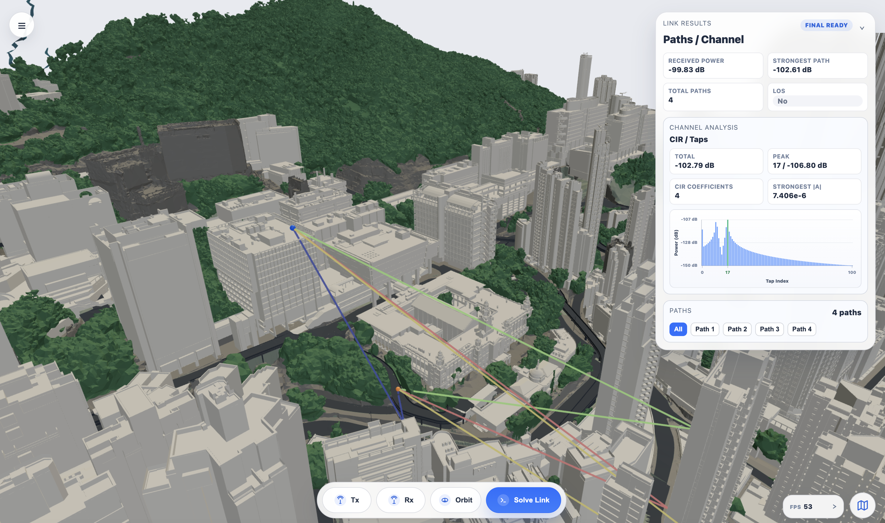

<p align="center">
  <picture>
    <source media="(prefers-color-scheme: dark)" srcset="backend/static/assets/openairtwin_logo_dark.png">
    <source media="(prefers-color-scheme: light)" srcset="backend/static/assets/openairtwin_logo.png">
    
  </picture>
</p>

<p align="center">
  <a href="LICENSE"></a>
  
  
  
  <a href="https://github.com/HKUOpenSource/OpenAirTwin/actions/workflows/ci.yml"></a>
</p>

<p align="center">
  <a href="https://hkuopensource.github.io/OpenAirTwin/">Tutorial</a> ·
  <a href="https://hkuopensource.github.io/OpenAirTwin/architecture/">Architecture map</a> ·
  <a href="docs/development.md">Development guide</a> ·
  <a href="CHANGELOG.md">Changelog</a> ·
  <a href="docs/data-licenses.md">Scene data notice</a> ·
  <a href="LICENSE">License</a>
</p>

OpenAirTwin is an open-source digital twin platform for interactive wireless
research. It combines a Python backend, a static browser frontend, tile-based
city scenes, and Sionna RT workflows for link analysis, mobility simulation,
radio-map generation, and DeepMIMO dataset export.

<p align="center">
  
</p>

> [!IMPORTANT]
> OpenAirTwin is research software. The server has no authentication and binds
> to `127.0.0.1` by default. Do not expose it to an untrusted network without an
> appropriate authenticated reverse proxy and additional hardening.

## Quick Start

### macOS or Linux

```bash
git clone https://github.com/HKUOpenSource/OpenAirTwin.git
cd OpenAirTwin
python3 install.py --with-sample-scene
set -a; . ./.oat-env; set +a
./.venv/bin/python -m backend.server
```

### Windows PowerShell

```powershell
git clone https://github.com/HKUOpenSource/OpenAirTwin.git
Set-Location OpenAirTwin
py -3.11 install.py --with-sample-scene
. .\.oat-env.ps1
.\.venv\Scripts\python.exe -m backend.server
```

The installer creates `.oat-env` on every platform and also creates
`.oat-env.ps1` on Windows. These files preserve the selected CPU/GPU and local
runtime configuration.

Open [http://127.0.0.1:8090](http://127.0.0.1:8090), then verify the installation:

1. Load the bundled sample scene from the map/scene controls.
2. Open **Link** mode.
3. Place one Tx and one Rx in the 3D scene.
4. Run the link solver and inspect the rendered propagation paths.
5. Open **Radar Sensing**, place its Tx and Rx, add a drone target from the 3D
   model picker, and run the asynchronous Radar solver.
6. Confirm that progress reaches completion and inspect the Range–Doppler,
   range-profile, detection and propagation-path results.

For guided workflows with videos, use the
[OpenAirTwin tutorial](https://hkuopensource.github.io/OpenAirTwin/).

## Features

| Feature | Workflow | Main output |
| --- | --- | --- |
| Map and scene management | Select Hong Kong map tiles, download scene data, and load only the required city geometry | Incremental 3D scene |
| Link analysis | Place Tx/Rx points and configure the shared RT solver | Paths, received power, channel taps, CIR and frequency response |
| Radar sensing | Place monostatic or bistatic Radar Tx/Rx, add moving drone targets, and configure OFDM, CA-CFAR and propagation parameters | Range–Doppler and range-profile plots, detections, target truth and classified propagation paths |
| Mobility | Define Rx waypoints, speed and sampling parameters | Trajectory, sample markers and time-varying channel results |
| Radio map | Configure a receiver patch, resolution and display range | Scalar heatmap over the 3D scene |
| DeepMIMO export | Draw a receiver ROI and configure the receiver grid | Downloadable DeepMIMO-compatible dataset |


## Documentation

- [Interactive architecture map](https://hkuopensource.github.io/OpenAirTwin/architecture/):
  current frontend, transport, backend service, job and renderer relationships;
  its versioned source is [`docs/openairtwin-architecture.html`](docs/openairtwin-architecture.html).
- [Development guide](docs/development.md): repository structure, tests,
  architectural boundaries and the process for adding a Feature.
- [Changelog](CHANGELOG.md) and [release checklist](docs/release-checklist.md):
  the v1.0.0 release record and the maintainer publication sequence.
- [Scene data and third-party terms](docs/data-licenses.md): Open3Dhk/CSDI data
  responsibilities, bundled sample-scene attribution and Radar drone-model
  licensing.
- [Video tutorial](https://hkuopensource.github.io/OpenAirTwin/): browser-led
  walkthroughs for the map and all five current analysis Features.

## Installation Details

### Requirements

- Python 3.11 or newer.
- A modern browser with WebGL support.
- A GPU-capable environment is recommended for practical Sionna RT workloads.
- CPU-only machines need LLVM for the Dr.Jit backend.

Sionna RT, Mitsuba, Dr.Jit, CUDA and GPU-driver compatibility are environment
specific. The installer creates or reuses `.venv/`, installs the pinned packages
from `requirements.txt`, writes local runtime configuration, and reports
system-level issues that still need action.

Run the interactive installer from the repository root:

```bash
python3 install.py
```

It can detect NVIDIA GPUs, select a GPU when multiple devices are present,
download the sample scene, run environment diagnostics, and print the matching
launch command.

### CPU-only Install

Install LLVM first, then force CPU mode.

macOS:

```bash
brew install llvm
python3 install.py --cpu
```

Ubuntu or Debian:

```bash
sudo apt update
sudo apt install llvm
python3 install.py --cpu
```

Windows users should install LLVM from the official
[LLVM download page](https://releases.llvm.org/download.html), reopen PowerShell,
and run:

```powershell
py -3.11 install.py --cpu
```

### Installer Flags

- `--with-sample-scene`: download the bundled `11_SW_7A-D` sample scene.
- `--no-sample-scene`: skip the sample-scene prompt.
- `--gpu <index-or-uuid>`: pin a specific GPU.
- `--cpu`: force CPU mode by clearing `CUDA_VISIBLE_DEVICES`.
- `--yes`: use non-interactive defaults; combine it with
  `--with-sample-scene` when the scene is required.
- `--doctor`: run diagnostics without reinstalling packages.
- `--recreate-venv`: remove and rebuild `.venv/`.
- `--dry-run`: print planned installer actions without changing local files.

Run `python3 install.py --help` for the authoritative option list.

## Scene Data

Link, Radar Sensing, Radiomap, Mobility and DeepMIMO workflows require scene data. The sample
archive contains four Open3Dhk tiles: `11_SW_7A`, `11_SW_7B`, `11_SW_7C` and
`11_SW_7D`. Install it with:

```bash
python3 install.py --with-sample-scene
```

Runtime scene assets use this layout by default:

```text
scene/
|-- common/
|   `-- scene_common.xml
|-- tiles/
|   `-- <tile_id>.xml
|-- meshes/
|   `-- <tile_id>/<category>/*.ply
`-- cache/
    `-- render_bundles/
```

Use a different scene root with:

```bash
OAT_SCENE_ROOT=/path/to/scene python3 -m backend.server
```

Build or refresh frontend tile bundles with:

```bash
python3 -m backend.tools.build_tile_bundles --help
```

OpenAirTwin's Apache-2.0 license does not cover third-party government spatial
data. Review [Scene data and third-party terms](docs/data-licenses.md) before
redistributing scene data or derived products.

## Configuration

Runtime behavior is configured with `OAT_*` environment variables. Common
options include:

| Variable | Purpose |
| --- | --- |
| `OAT_HOST`, `OAT_PORT` | Backend bind address; defaults to `127.0.0.1:8090` |
| `OAT_SCENE_ROOT` | Runtime scene root |
| `OAT_GENERATED_ROOT` | Generated job and runtime XML output root |
| `OAT_DEFAULT_FREQUENCY_HZ` | Default carrier frequency |
| `OAT_DEFAULT_MAX_DEPTH` | Default RT path depth |
| `OAT_DEFAULT_LINK_SAMPLES` | Default Link sample budget |
| `OAT_DEFAULT_RADIOMAP_SAMPLES` | Default Radiomap sample budget |
| `OAT_DEEPMIMO_ENV_PYTHON` | Python executable used by DeepMIMO workers |
| `OAT_MAP_DOWNLOAD_BASE_URL`, `OAT_MAP_DOWNLOAD_FORMAT`, `OAT_MAP_DOWNLOAD_KEY` | Optional tile-download source |

The complete and authoritative list, including validation and queue limits, is
defined in [`backend/config.py`](backend/config.py). Restart the server after
changing runtime environment values.

## Development and Testing

Run the Python suite from the repository root:

```bash
python3 -m unittest discover -s tests -p 'test_*.py'
```

Run Playwright feature and visual regressions:

```bash
cd tests/browser
npm ci
npx playwright install chromium
npm test
```

Build the tutorial website:

```bash
cd website
npm ci
npm test
npm run build
```

See the [development guide](docs/development.md) before changing Feature
registration, REST contracts, viewer layers or shared settings.

## Repository Layout

```text
.
|-- backend/
|   |-- features/          # Backend Feature definitions and route catalog
|   |-- jobs/              # In-process and subprocess job managers
|   |-- rt/                # Sionna RT solvers and scene runtime
|   |-- scene/             # Tile scene generation and bundle tooling
|   `-- static/
|       `-- js/
|           |-- core/      # Feature registry, store, settings and picking
|           |-- features/  # Feature-owned state, transport and renderers
|           `-- viewer/    # Layer, primitive and asset infrastructure
|-- docs/                  # Architecture and contributor documentation
|-- tests/                 # Python unit, contract and regression tests
|   `-- browser/           # Playwright behavior and visual baselines
|-- website/               # React/Vite tutorial website
|-- CHANGELOG.md           # Release history and pending user-visible changes
|-- CITATION.cff           # Machine-readable software citation metadata
|-- install.py             # Cross-platform installer and environment doctor
|-- requirements-test.txt  # Minimal dependencies for automated test jobs
|-- requirements.txt       # Pinned Python runtime dependencies
|-- LICENSE
`-- README.md
```

## Troubleshooting

- Run `python3 install.py --doctor` after changing Python, CUDA, drivers or LLVM.
- Missing `nvidia-smi` is not necessarily a failure; CPU mode can run when the
  Dr.Jit LLVM backend passes diagnostics.
- CUDA warnings commonly indicate an NVIDIA driver, CUDA,
  `CUDA_VISIBLE_DEVICES`, or Mitsuba CUDA variant mismatch.
- If the browser opens but analysis cannot run, confirm that a scene is loaded
  and that all four sample tile XML/mesh directories are present.
- On Windows, start through `.oat-env.ps1` so GPU selection and cache paths are
  applied to the current PowerShell process.

## Contributing

Issues and pull requests are welcome. Keep existing REST contracts and UI
behavior backward compatible unless the change explicitly introduces a versioned
contract. New analysis capabilities should use the frontend and backend Feature
catalogs instead of adding mode-specific branches to core entry points. Run the
relevant Python and Playwright suites before submitting a change.

## Citation

If OpenAirTwin contributes to your work, cite the version used. For this
release:

> Wang, Z., Zhou, Z., & Zhao, Z. (2026). OpenAirTwin (Version 1.0.0)
> [Computer software]. https://github.com/HKUOpenSource/OpenAirTwin/releases/tag/v1.0.0

Machine-readable citation metadata is available in [`CITATION.cff`](CITATION.cff).

## License

OpenAirTwin source code is released under the Apache License 2.0. See
[`LICENSE`](LICENSE) for details. Scene data and other third-party assets remain
subject to their respective terms.
